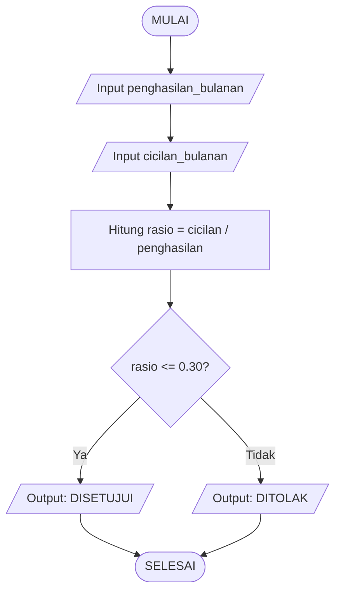

# Pertemuan 2: Algoritma, Flowchart & Pseudocode

## 🎯 Learning Outcomes

Setelah belajar ini, kamu akan bisa:

- Menjelaskan apa itu algoritma dan menyebutkan 5 sifat wajibnya
- Membuat flowchart menggunakan simbol-simbol standar (terminal, proses, keputusan, I/O) secara benar
- Menulis pseudocode yang terstruktur dan mudah dibaca manusia
- Mengkonversi pseudocode menjadi kode Python yang berjalan
- Menggunakan tools seperti draw.io atau Mermaid untuk membuat diagram flowchart

---

## 📖 Pengantar (Hook)

Bayangin kamu kerja di startup fintech. Suatu hari, tim risk management panik karena ada 300 transaksi aneh masuk dalam 5 menit — nominal kecil-kecil, tapi berulang dari ratusan akun berbeda. Itu serangan *card testing fraud*.

Bos kamu bilang: "Kita butuh sistem deteksi otomatis. Kalau ada akun yang transaksi lebih dari 5 kali dalam 1 menit, langsung blokir sementara."

Kamu duduk di depan laptop. Dari mana mulai nulis kodenya?

Di sinilah **algoritma** berperan. Sebelum nulis satu baris pun kode Python, kamu perlu *berpikir dulu*: apa langkah-langkahnya? Apa kondisinya? Apa yang terjadi kalau kondisi terpenuhi? Apa yang terjadi kalau tidak?

Algoritma, flowchart, dan pseudocode adalah alat berpikir sebelum kamu menyentuh keyboard. Programmer yang baik bukan yang langsung ngetik — tapi yang tahu mau ngapain dulu.

---

## 🧩 Konsep Utama

### Apa Itu Algoritma?

Algoritma adalah **urutan langkah-langkah logis yang terbatas untuk menyelesaikan suatu masalah**. Kata kuncinya: *urutan*, *logis*, dan *terbatas*.

Kamu sudah sering pakai algoritma sehari-hari tanpa sadar:
- Resep masak = algoritma bikin nasi goreng
- Petunjuk IKEA = algoritma merakit lemari
- SOP transfer bank = algoritma memindahkan uang

### 5 Sifat Wajib Algoritma (Donald Knuth)

| Sifat | Penjelasan | Contoh Pelanggaran |
|---|---|---|
| **Finiteness** | Harus berhenti pada titik tertentu | Loop tanpa kondisi berhenti |
| **Definiteness** | Setiap langkah harus jelas dan tidak ambigu | "Proses transaksi kalau dirasa aman" — *dirasa* itu tidak definit |
| **Input** | Boleh nol atau lebih input | Algoritma hitung luas lingkaran butuh input jari-jari |
| **Output** | Minimal menghasilkan satu output | Harus ada hasil akhir yang bisa digunakan |
| **Effectiveness** | Setiap operasi harus bisa dilakukan (feasible) | Tidak boleh ada langkah "bagi dengan 0" |

### Flowchart

Flowchart adalah **representasi visual algoritma** menggunakan simbol-simbol standar. Digunakan untuk:
- Komunikasi antar tim (developer, analis, desainer)
- Dokumentasi sistem
- Menemukan celah logika sebelum coding

### Simbol Standar Flowchart

| Simbol | Nama | Fungsi | Contoh |
|---|---|---|---|
| Oval / Rounded Rect | **Terminal** | Titik awal dan akhir program | START, END |
| Jajar Genjang | **Input/Output** | Menerima data dari user atau menampilkan hasil | Input PIN, Tampilkan saldo |
| Persegi Panjang | **Proses** | Operasi/kalkulasi | Hitung total = harga × qty |
| Belah Ketupat | **Keputusan** | Percabangan kondisi (Ya/Tidak) | Saldo >= nominal? |
| Panah | **Aliran** | Menghubungkan simbol, menunjukkan urutan | → |

### Pseudocode

Pseudocode adalah **kode palsu** — ditulis seperti bahasa manusia, bukan bahasa mesin, tapi berstruktur seperti program. Tidak ada aturan baku yang kaku, tapi biasanya menggunakan kata-kata seperti:
- `IF ... THEN ... ELSE ... END IF`
- `WHILE ... DO ... END WHILE`
- `FOR ... TO ... DO ... END FOR`
- `INPUT`, `OUTPUT`, `SET`, `COMPUTE`

---

## 🧠 Ilustrasi / Analogi

### Analogi: SOP Kasir Minimarket

Bayangkan kasir minimarket. Prosesnya adalah:

```
1. Sambut pelanggan
2. Scan semua barang
3. Hitung total belanja
4. Tanya: bayar tunai atau non-tunai?
   - Kalau tunai: terima uang, hitung kembalian
   - Kalau non-tunai: proses kartu/QRIS
5. Cetak struk
6. Ucapkan terima kasih
```

Ini adalah algoritma. Flowchart akan menggambarkannya secara visual dengan simbol. Pseudocode akan menuliskannya dengan struktur lebih formal. Python akan mengeksekusinya di komputer.

### Perbedaan Algoritma, Flowchart, dan Pseudocode

| Aspek | Algoritma | Flowchart | Pseudocode |
|---|---|---|---|
| **Bentuk** | Narasi/deskripsi | Diagram visual | Teks terstruktur |
| **Tujuan** | Merumuskan solusi | Komunikasi visual | Jembatan ke kode |
| **Pembaca** | Semua orang | Semua orang | Programmer |
| **Tools** | Kertas, dokumen | draw.io, Mermaid | Teks editor |

---

## 💻 Contoh Teknis

### Contoh 1: Konversi Pseudocode → Python (Cek Kelayakan Pinjaman Sederhana)

**Pseudocode:**
```
MULAI
  INPUT penghasilan_bulanan
  INPUT cicilan_bulanan
  COMPUTE rasio = cicilan_bulanan / penghasilan_bulanan
  IF rasio <= 0.30 THEN
    OUTPUT "Pinjaman DISETUJUI"
  ELSE
    OUTPUT "Pinjaman DITOLAK - rasio cicilan terlalu tinggi"
  END IF
SELESAI
```

**Python:**
```python
# Konversi pseudocode ke Python

# INPUT
penghasilan_bulanan = float(input("Masukkan penghasilan bulanan (Rp): "))
cicilan_bulanan = float(input("Masukkan estimasi cicilan per bulan (Rp): "))

# COMPUTE
rasio = cicilan_bulanan / penghasilan_bulanan

# DECISION
if rasio <= 0.30:
    print("Pinjaman DISETUJUI ✅")
    print(f"Rasio cicilan kamu: {rasio:.1%} (di bawah batas 30%)")
else:
    print("Pinjaman DITOLAK ❌")
    print(f"Rasio cicilan kamu: {rasio:.1%} (melebihi batas 30%)")
```

**Output contoh:**
```
Masukkan penghasilan bulanan (Rp): 8000000
Masukkan estimasi cicilan per bulan (Rp): 2000000
Pinjaman DISETUJUI ✅
Rasio cicilan kamu: 25.0% (di bawah batas 30%)
```

### Contoh 2: Flowchart dalam Format Mermaid

Mermaid adalah syntax berbasis teks untuk membuat diagram. Bisa dirender di GitHub, Notion, dan banyak tools lain.



### Contoh 3: Algoritma dengan Perulangan (Hitung Total Transaksi)

**Pseudocode:**
```
MULAI
  SET total = 0
  SET n = 0
  INPUT jumlah_transaksi
  WHILE n < jumlah_transaksi DO
    INPUT nominal
    SET total = total + nominal
    SET n = n + 1
  END WHILE
  OUTPUT "Total transaksi: " + total
SELESAI
```

**Python:**
```python
# Menghitung total transaksi dari beberapa input

total = 0
jumlah_transaksi = int(input("Berapa banyak transaksi? "))

for i in range(jumlah_transaksi):
    nominal = float(input(f"Nominal transaksi ke-{i+1} (Rp): "))
    total += nominal

print(f"\nTotal seluruh transaksi: Rp {total:,.0f}")
```

---

## 🏦 Studi Kasus Nyata (Fintech / Backend)

### Kasus: Flowchart Proses Verifikasi Login dengan OTP

**Latar Belakang:**
Sebuah aplikasi dompet digital (e-wallet) ingin mengamankan proses login. Setiap kali user login dari perangkat baru, sistem harus mengirimkan OTP (One-Time Password) ke nomor HP yang terdaftar. OTP hanya berlaku 60 detik dan maksimal 3 kali percobaan.

**Masalah Bisnis:**
Tanpa proses verifikasi yang terstruktur, akun bisa diakses dari perangkat tidak dikenal tanpa sepengetahuan pemilik. Ini bisa menyebabkan kebocoran data dan kerugian finansial nasabah.

**Flowchart Proses Verifikasi OTP:**

```mermaid
flowchart TD
    A([MULAI]) --> B[/Input: username & password/]
    B --> C{Kredensial valid?}
    C -- Tidak --> D[/Output: Login gagal/]
    D --> E{Percobaan < 3?}
    E -- Ya --> B
    E -- Tidak --> F[Blokir akun 15 menit]
    F --> G([SELESAI])
    C -- Ya --> H{Perangkat dikenal?}
    H -- Ya --> I[Login berhasil langsung]
    H -- Tidak --> J[Kirim OTP ke HP terdaftar]
    J --> K[/Input: kode OTP/]
    K --> L{OTP benar?}
    L -- Tidak --> M{Percobaan OTP < 3?}
    M -- Ya --> K
    M -- Tidak --> N[Blokir sesi, kirim notifikasi]
    N --> G
    L -- Ya --> O{OTP masih berlaku? (< 60 detik)}
    O -- Tidak --> P[/Output: OTP kadaluarsa, kirim ulang/]
    P --> J
    O -- Ya --> Q[Tandai perangkat sebagai dikenal]
    Q --> I
    I --> G
```

**Pseudocode:**
```
MULAI
  INPUT username, password
  SET percobaan_login = 0

  WHILE percobaan_login < 3 DO
    IF kredensial_valid(username, password) THEN
      IF perangkat_dikenal() THEN
        OUTPUT "Login berhasil"
        SELESAI
      ELSE
        KIRIM otp ke nomor_hp_terdaftar
        SET percobaan_otp = 0
        SET waktu_kirim = waktu_sekarang()

        WHILE percobaan_otp < 3 DO
          INPUT kode_otp
          IF waktu_sekarang() - waktu_kirim > 60 THEN
            OUTPUT "OTP kadaluarsa"
            KIRIM otp baru
            SET waktu_kirim = waktu_sekarang()
          ELSE IF kode_otp == otp_yang_dikirim THEN
            TANDAI perangkat sebagai dikenal
            OUTPUT "Login berhasil"
            SELESAI
          ELSE
            SET percobaan_otp = percobaan_otp + 1
          END IF
        END WHILE
        BLOKIR sesi, KIRIM notifikasi ke user
      END IF
    ELSE
      SET percobaan_login = percobaan_login + 1
    END IF
  END WHILE

  BLOKIR akun selama 15 menit
SELESAI
```

**Dampak Bisnis:**
- Tanpa flowchart yang jelas, developer bisa melewatkan edge case seperti "OTP kadaluarsa tapi percobaan belum habis"
- Flowchart ini menjadi dokumentasi yang bisa direview oleh tim security, produk, dan QA sebelum satu baris kode pun ditulis
- Proses seperti ini nyata digunakan di OVO, GoPay, Dana, dan produk e-wallet lainnya

---

## 📊 Visualisasi

### Step-by-Step: Cara Membuat Flowchart yang Benar

```
Langkah 1: Identifikasi MASALAH
  → "Apa yang ingin diselesaikan?"
  Contoh: Tentukan apakah user bisa melakukan transaksi

Langkah 2: Tentukan INPUT
  → Data apa yang dibutuhkan?
  Contoh: saldo, nominal_transaksi, limit_harian

Langkah 3: Tentukan PROSES
  → Apa yang perlu dihitung atau dilakukan?
  Contoh: cek saldo mencukupi, cek limit harian

Langkah 4: Tentukan KEPUTUSAN (Decision Points)
  → Di mana ada percabangan "jika ... maka ..."?
  Contoh: saldo >= nominal? | total_hari_ini + nominal <= limit?

Langkah 5: Tentukan OUTPUT
  → Apa hasilnya?
  Contoh: "Transaksi berhasil" atau "Saldo tidak cukup"

Langkah 6: Gambar dari atas ke bawah
  → Gunakan simbol standar, panah jelas, label Ya/Tidak di cabang
```

### Checklist Flowchart yang Benar

- [ ] Ada titik START dan END (simbol oval/terminal)
- [ ] Setiap simbol keputusan punya dua cabang keluar (Ya dan Tidak)
- [ ] Tidak ada panah yang "menggantung" (tidak menuju ke mana-mana)
- [ ] Aliran dari atas ke bawah, kiri ke kanan
- [ ] Setiap proses hanya punya satu panah masuk dan satu keluar
- [ ] Label pada setiap panah dari keputusan (Ya/Tidak, True/False)

---

## ⚠️ Kesalahan Umum

### 1. Flowchart Tanpa Label di Cabang Keputusan
**Salah:** Belah ketupat punya dua panah keluar tapi tidak ada label "Ya" atau "Tidak"
**Benar:** Selalu beri label pada setiap panah yang keluar dari simbol keputusan

### 2. Algoritma Tanpa Kondisi Berhenti
**Salah:**
```
WHILE saldo > 0 DO
  bayar cicilan
END WHILE
```
Kalau cicilan lebih kecil dari saldo, ini akan loop selamanya!

**Benar:**
```
WHILE saldo > 0 AND ada_cicilan_tersisa DO
  bayar cicilan
  kurangi jumlah cicilan
END WHILE
```

### 3. Pseudocode Terlalu Detail (Seperti Kode Asli)
**Salah:**
```
rasio = float(cicilan) / float(penghasilan) * 100
if rasio <= 30.0:
```
Itu sudah kode Python, bukan pseudocode!

**Benar:**
```
COMPUTE rasio = cicilan dibagi penghasilan
IF rasio <= 30% THEN
```

### 4. Mengabaikan Edge Case
Contoh: Flowchart cek PIN tapi lupa tangani kasus kalau user salah PIN 3 kali berturut-turut. Di dunia nyata, ini celah keamanan besar.

### 5. Proses Terlalu Ambigu
**Salah:** Kotak proses bertuliskan "Proses data user"
**Benar:** "Validasi format email dan nomor HP" — spesifik dan bisa langsung diimplementasi

---

## 🧪 Latihan / Studi Kasus

### Soal 1 — Konsep

Sebuah algoritma memiliki langkah berikut:
```
1. Minta user masukkan angka
2. Kalikan dengan 2
3. Tampilkan hasilnya
4. Kembali ke langkah 1
```

**Pertanyaan:**
a) Apakah algoritma ini memenuhi sifat *Finiteness*? Mengapa?
b) Perbaiki algoritma di atas agar memenuhi semua 5 sifat algoritma
c) Gambar flowchart-nya setelah diperbaiki

### Soal 2 — Studi Kasus Fintech

**Skenario:** Kamu diminta membuat sistem persetujuan *pinjaman cepat* untuk aplikasi fintech. Aturan bisnisnya:

- Penghasilan bulanan minimal Rp 3.000.000
- Usia peminjam antara 21–55 tahun
- Tidak memiliki tunggakan pinjaman aktif
- Jumlah pinjaman maksimal 30% dari penghasilan bulanan × 12 bulan (tenor 1 tahun)

**Tugas:**
1. Buat pseudocode untuk proses persetujuan pinjaman ini
2. Gambar flowchart-nya menggunakan simbol standar (boleh pakai draw.io atau tulis deskripsi simbolnya)
3. Konversikan pseudocode ke Python

**Contoh output yang diharapkan:**
```
=== Sistem Pinjaman Cepat ===
Penghasilan bulanan: Rp 5.000.000
Usia: 28 tahun
Tunggakan aktif: Tidak

✅ Selamat! Pengajuan pinjaman kamu DISETUJUI
Maksimal pinjaman: Rp 18.000.000
```

### Soal 3 — Tantangan (Opsional)

Buat flowchart Mermaid untuk proses **top-up saldo e-wallet** dengan kondisi:
- Minimal top-up Rp 10.000
- Maksimal top-up Rp 10.000.000 per transaksi
- Jika user belum verifikasi KTP, maksimal top-up Rp 2.000.000 per hari
- Tampilkan konfirmasi sebelum proses

---

## 📌 Ringkasan

- **Algoritma** = urutan langkah logis, terbatas, jelas, punya input/output, dan setiap langkahnya feasible
- **5 Sifat Algoritma:** Finiteness, Definiteness, Input, Output, Effectiveness
- **Simbol Flowchart:**
  - Oval → Terminal (START/END)
  - Jajar genjang → Input/Output
  - Persegi panjang → Proses
  - Belah ketupat → Keputusan (Ya/Tidak)
- **Pseudocode** = kode palsu berbahasa manusia, jembatan antara ide dan implementasi
- **Urutan kerja yang benar:** Pahami masalah → Algoritma → Flowchart → Pseudocode → Kode
- **Tools:** draw.io (GUI), Mermaid (teks), Lucidchart (kolaborasi)
- **Di dunia nyata:** Flowchart dipakai untuk review proses bisnis, dokumentasi API, dan onboarding developer baru
- Flowchart yang baik = tidak ambigu, semua cabang diberi label, ada START dan END
