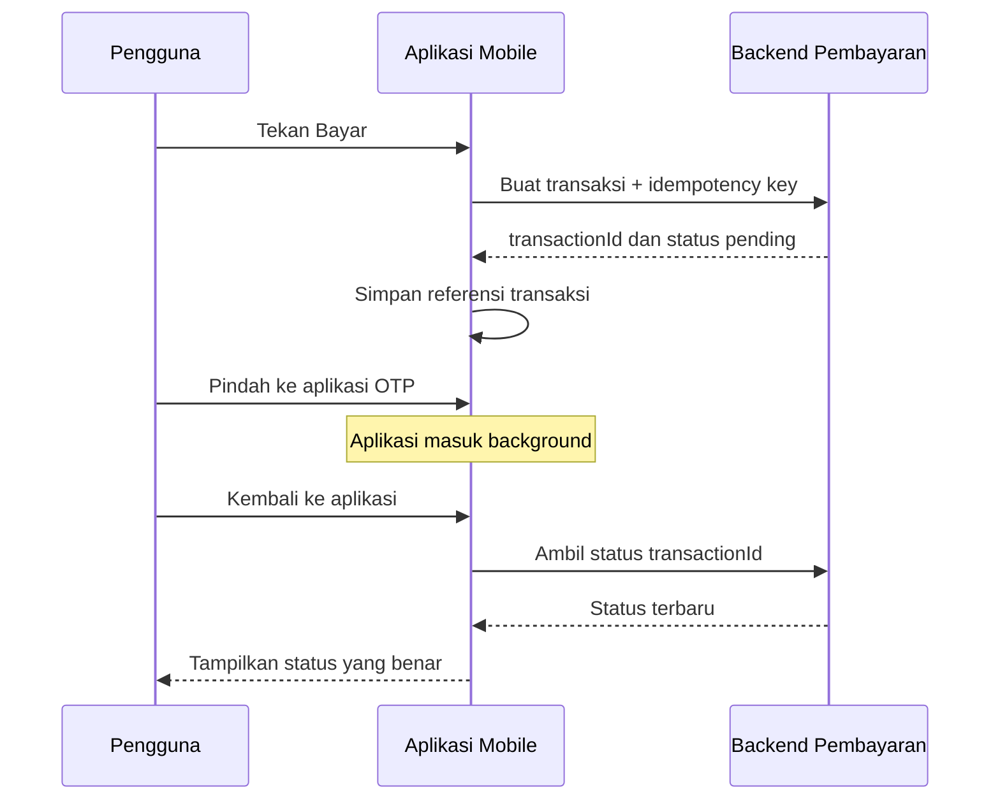

# Pertemuan 1: Native, Cross-Platform, dan Siklus Hidup Aplikasi Mobile

> **Mata kuliah:** Pemrograman Mobile (MU5502)  
> **Bobot:** 3 SKS (2 teori + 1 praktik)  
> **Durasi pertemuan:** 150 menit  
> **Acuan RPS:** CPMK-1 dan Sub-CPMK-1  
> **Fokus:** karakteristik pengembangan mobile, native vs cross-platform, siklus hidup aplikasi/activity/widget, serta gambaran Flutter dan Android Studio

---

## 1. 🎯 Learning Outcomes

Setelah mengikuti pertemuan ini, kamu akan bisa:

1. menjelaskan karakteristik aplikasi mobile dan perbedaannya dari aplikasi web;
2. membedakan pendekatan **native** dan **cross-platform** berdasarkan bahasa, akses fitur perangkat, performa, biaya, dan kebutuhan tim;
3. memilih pendekatan pengembangan yang masuk akal untuk sebuah kasus sederhana dan menjelaskan alasannya;
4. menjelaskan mengapa aplikasi memiliki **siklus hidup** serta mengenali kondisi aktif, tidak aktif, berjalan di latar belakang, dan dihentikan;
5. membedakan lifecycle aplikasi, screen/activity, dan widget agar tidak salah menempatkan proses bisnis;
6. mengenali peran Flutter, Dart, Kotlin, Jetpack Compose, Android Studio, emulator, dan perangkat fisik dalam ekosistem pengembangan mobile; dan
7. menjalankan pemeriksaan awal lingkungan pengembangan serta membaca hasil diagnosisnya.

### Keterkaitan dengan OBE

| Elemen RPS | Implementasi pada pertemuan ini |
|---|---|
| CPMK-1 | Memahami karakteristik pengembangan mobile dan siklus hidup aplikasi |
| Sub-CPMK-1 | Menjelaskan native vs cross-platform serta lifecycle aplikasi/activity/widget |
| CPL-2 | Membandingkan alternatif dan memberi alasan teknis |
| CPL-5 | Memilih pendekatan solusi sesuai kebutuhan pengguna |
| Indikator | Penjelasan konsep, analisis kasus, dan hasil pemeriksaan toolchain |
| Penilaian RPS | Kuis konsep dan diskusi kelas, bobot 1% |

---

## 2. 📖 Pengantar: Aplikasi Pembayaran yang Terlihat Sederhana

Bayangkan kamu sedang membayar kopi dengan aplikasi dompet digital:

1. kamu membuka aplikasi;
2. memilih menu bayar;
3. memindai QR;
4. berpindah ke aplikasi pesan untuk melihat kode OTP;
5. kembali ke aplikasi pembayaran;
6. menekan tombol konfirmasi.

Dari sisi pengguna, proses itu hanya berlangsung beberapa detik. Dari sisi sistem, banyak hal terjadi:

- kamera diakses dengan izin pengguna;
- aplikasi pembayaran sempat kehilangan fokus;
- screen pembayaran mungkin masuk ke background;
- memori aplikasi dapat direklamasi oleh sistem operasi;
- koneksi internet dapat berubah dari Wi-Fi ke seluler;
- permintaan pembayaran mungkin terkirim dua kali jika tombol ditekan ulang;
- UI harus kembali dengan data transaksi yang masih benar.

Inilah perbedaan penting antara membuat tampilan dan membangun aplikasi mobile yang dapat dipercaya. Aplikasi mobile hidup di lingkungan yang berubah-ubah, memiliki sumber daya terbatas, serta harus berkoordinasi dengan sistem operasi, perangkat keras, dan backend.

Pertemuan ini membangun peta besarnya. Kita belum membuat aplikasi lengkap, tetapi setelah selesai kamu seharusnya memahami **apa yang sedang dibangun, pilihan teknologi yang tersedia, dan mengapa lifecycle tidak boleh diabaikan**.

---

## 3. 🧩 Konsep Utama

### 3.1 Apa yang Disebut Aplikasi Mobile?

Aplikasi mobile adalah perangkat lunak yang dirancang untuk berjalan pada perangkat bergerak seperti smartphone atau tablet. Ia berinteraksi dengan tiga lingkungan sekaligus:

1. **Pengguna dan antarmuka**  
   Sentuhan, gesture, ukuran layar, orientasi, aksesibilitas, serta pola penggunaan singkat dan berulang.

2. **Sistem operasi dan perangkat**  
   Kamera, lokasi, notifikasi, penyimpanan, biometrik, baterai, jaringan, serta mekanisme permission.

3. **Layanan backend**  
   REST API, autentikasi, basis data, penyimpanan berkas, analitik, dan layanan transaksi.

```text
┌─────────────────────────────────────────────────────────┐
│ Pengguna                                                │
│ tap • swipe • input • izin • berpindah aplikasi         │
└───────────────────────┬─────────────────────────────────┘
                        │
┌───────────────────────▼─────────────────────────────────┐
│ Aplikasi Mobile                                        │
│ UI • navigasi • state • validasi • cache • lifecycle    │
└───────────────┬───────────────────────┬─────────────────┘
                │                       │
┌───────────────▼────────────┐  ┌───────▼─────────────────┐
│ Sistem Operasi dan Device │  │ Backend dan Cloud       │
│ kamera • GPS • storage    │  │ API • auth • database   │
│ notifikasi • biometrik    │  │ transaksi • monitoring │
└────────────────────────────┘  └─────────────────────────┘
```

### 3.2 Karakteristik Khas Pengembangan Mobile

#### Sumber daya terbatas

Perangkat memiliki baterai, CPU, memori, dan ruang penyimpanan yang terbatas. Proses berat, polling terus-menerus, atau pemuatan gambar tanpa optimasi dapat menguras baterai dan membuat aplikasi tersendat.

#### Jaringan tidak selalu stabil

Pengguna dapat masuk lift, berpindah jaringan, atau kehilangan sinyal. Karena itu aplikasi perlu memiliki loading state, timeout, retry yang terkontrol, cache, dan pesan kesalahan yang berguna.

#### Banyak ukuran dan kondisi layar

UI harus tetap terbaca pada ukuran layar, kerapatan piksel, orientasi, dan pengaturan font yang berbeda. Desain yang bagus di satu emulator belum tentu bagus di perangkat lain.

#### Akses perangkat memerlukan izin

Kamera, mikrofon, lokasi, kontak, dan notifikasi memiliki aturan permission. Izin harus diminta pada saat yang masuk akal dan disertai alasan yang dipahami pengguna.

#### Lifecycle dikendalikan bersama sistem operasi

Aplikasi tidak selalu bebas menentukan kapan ia aktif atau berhenti. Telepon masuk, perpindahan aplikasi, penghematan baterai, dan tekanan memori dapat mengubah state aplikasi.

#### Distribusi memiliki proses khusus

Aplikasi perlu dibangun menjadi artefak seperti APK atau App Bundle, ditandatangani, diuji, dan didistribusikan melalui kanal tertentu. Rilis mobile bukan sekadar mengunggah berkas sumber.

### 3.3 Native dan Cross-Platform

#### Native

Pada pendekatan **native**, aplikasi dibuat khusus untuk satu platform menggunakan bahasa dan toolkit yang didukung langsung oleh platform tersebut.

Contoh:

- Android: Kotlin dengan Jetpack Compose atau Android Views;
- iOS: Swift dengan SwiftUI atau UIKit.

Keunggulan utama native adalah integrasi langsung dengan API platform, dukungan fitur terbaru yang biasanya lebih cepat, dan kontrol platform yang mendalam. Konsekuensinya, dukungan Android dan iOS umumnya membutuhkan codebase atau keahlian platform yang berbeda.

#### Cross-platform

Pada pendekatan **cross-platform**, sebagian besar kode ditulis sekali dan digunakan untuk lebih dari satu platform. Flutter menggunakan Dart dan menyediakan toolkit UI lintas platform. Aplikasi tetap dikemas sebagai aplikasi untuk platform tujuan dan dapat mengakses layanan platform melalui plugin atau integrasi native.

Cross-platform tidak berarti:

- seluruh kode pasti 100% sama;
- aplikasi otomatis bagus di semua perangkat;
- developer tidak perlu memahami Android dan iOS;
- performanya selalu lebih lambat atau selalu sama dengan native.

Bagian tertentu seperti permission, signing, konfigurasi build, notifikasi, pembayaran dalam aplikasi, atau integrasi SDK vendor tetap dapat memerlukan penanganan spesifik platform.

### 3.4 Perbandingan Pendekatan

| Aspek | Native | Cross-platform |
|---|---|---|
| Target utama | Satu platform per implementasi | Beberapa platform dari codebase bersama |
| Contoh | Kotlin + Jetpack Compose, Swift + SwiftUI | Flutter + Dart |
| Berbagi kode | Terbatas antarplatform | Tinggi untuk UI dan business logic, tetapi tidak selalu 100% |
| Akses API perangkat | Langsung dan biasanya paling awal | Melalui framework, plugin, atau kode native |
| Konsistensi UI | Sangat sesuai konvensi platform | Mudah dibuat konsisten lintas platform |
| Kebutuhan tim | Spesialis Android dan/atau iOS | Tim inti lintas platform, ditambah kemampuan native saat perlu |
| Kecepatan MVP | Dapat lebih lambat untuk dua platform | Sering lebih cepat untuk cakupan Android dan iOS |
| Risiko | Duplikasi implementasi antarplatform | Ketergantungan pada framework/plugin dan kasus khusus platform |
| Cocok ketika | Integrasi platform sangat dalam atau target hanya satu platform | Tim terbatas, fitur relatif seragam, dan perlu merilis ke beberapa platform |

### 3.5 Jangan Memilih Framework Hanya dari Tren

Gunakan pertanyaan berikut sebelum memilih pendekatan:

1. Platform apa yang benar-benar dibutuhkan pengguna?
2. Apakah aplikasi memakai fitur device yang sangat spesifik?
3. Seberapa ketat target performa, animasi, dan startup time?
4. Apakah UI harus sangat mengikuti karakter tiap platform atau justru harus identik?
5. Keahlian apa yang dimiliki tim?
6. Berapa banyak waktu dan biaya yang tersedia?
7. Apakah SDK vendor yang wajib digunakan mendukung framework pilihan?
8. Siapa yang akan memelihara aplikasi setelah rilis?

#### Contoh keputusan

| Skenario | Pilihan awal yang masuk akal | Alasan |
|---|---|---|
| Aplikasi katalog UMKM untuk Android dan iOS, tim kecil | Flutter | Banyak UI dan logic dapat dibagi |
| Aplikasi kontrol perangkat Android khusus milik perusahaan | Native Android | Target tunggal dan integrasi device mendalam |
| Prototipe layanan reservasi untuk validasi pasar | Flutter | Iterasi lintas platform relatif cepat |
| Fitur Android terbaru yang sangat platform-specific | Native Android | API platform dapat digunakan langsung |

Pilihan pada tabel bukan jawaban mutlak. Keputusan teknologi selalu mengikuti kebutuhan, batasan, dan kompetensi tim.

### 3.6 Ekosistem yang Akan Digunakan

| Komponen | Peran |
|---|---|
| Android Studio | IDE, Android SDK, emulator, profiler, dan alat build Android |
| Flutter SDK | Framework dan toolchain untuk membangun aplikasi lintas platform |
| Dart | Bahasa pemrograman utama Flutter |
| Kotlin | Bahasa utama dalam pengembangan native Android modern |
| Jetpack Compose | Toolkit UI deklaratif yang direkomendasikan untuk Android native |
| Emulator | Perangkat virtual untuk menjalankan dan menguji aplikasi |
| ADB | Alat komunikasi dan diagnosis perangkat Android |
| Git dan GitHub | Version control dan kolaborasi source code |
| REST API | Jalur komunikasi terstruktur antara aplikasi dan backend |
| Firebase | Contoh backend cloud untuk autentikasi, data, dan layanan aplikasi |

Pada perkuliahan ini, implementasi utama dapat mengikuti **Flutter dan Dart**, sementara konsep native Android digunakan sebagai pembanding. Konsep seperti UI deklaratif, state, lifecycle, API, penyimpanan, dan pengujian tetap berguna ketika kamu berpindah framework.

### 3.7 Apa Itu Lifecycle?

**Lifecycle** adalah rangkaian keadaan yang dilalui aplikasi atau komponennya sejak dibuat, tampil, kehilangan fokus, berada di background, sampai dihentikan.

Mengapa lifecycle penting?

- proses kamera harus dihentikan ketika tidak digunakan;
- perubahan form perlu disimpan agar tidak hilang;
- koneksi atau listener perlu dilepas agar tidak bocor;
- data perlu dimuat pada waktu yang tepat;
- informasi sensitif dapat disembunyikan ketika aplikasi tidak aktif;
- aplikasi harus dapat pulih ketika sistem membuat ulang screen.

### 3.8 Tiga Lifecycle yang Sering Tertukar

#### 1. Lifecycle process atau aplikasi

Ini menggambarkan kondisi aplikasi secara keseluruhan: tampil di depan, kehilangan fokus, masuk background, atau prosesnya dihentikan. Sistem operasi dapat menghentikan proses background untuk menghemat sumber daya.

#### 2. Lifecycle screen atau Activity

Pada Android, `Activity` umumnya mewakili satu titik interaksi layar. Callback seperti `onCreate`, `onStart`, `onResume`, `onPause`, `onStop`, dan `onDestroy` memberi tahu perubahan keadaan Activity.

```text
onCreate → onStart → onResume
                         │
                    pengguna aktif
                         │
                     onPause
                         │
              ┌──────────┴──────────┐
              │ kembali cepat       │ tidak terlihat
              ▼                     ▼
           onResume               onStop
                                    │
                          ┌─────────┴─────────┐
                          │ kembali           │ selesai/dihapus
                          ▼                   ▼
                       onRestart          onDestroy
                          │
                       onStart
```

Diagram ini adalah model belajar. Dalam aplikasi nyata, jangan menganggap `onDestroy` selalu dipanggil sebelum proses dihentikan.

#### 3. Lifecycle widget atau komponen UI

Pada Flutter, `Widget` adalah deskripsi konfigurasi UI yang immutable. Untuk UI yang mempunyai data berubah, `StatefulWidget` memiliki objek `State` dengan tahapan penting seperti:

- `initState()` untuk inisialisasi satu kali;
- `didChangeDependencies()` ketika dependency berubah;
- `build()` untuk mendeskripsikan UI berdasarkan state;
- `dispose()` untuk membersihkan controller, observer, atau subscription.

Lifecycle widget **bukan** hal yang sama dengan lifecycle aplikasi. Sebuah widget dapat dibuat dan dibuang ketika aplikasi tetap aktif. Sebaliknya, aplikasi dapat masuk background sementara widget tertentu masih berada pada tree.

### 3.9 Keadaan Aplikasi pada Flutter

Flutter menyediakan informasi lifecycle aplikasi melalui `AppLifecycleState`. Keadaan yang dapat muncul mencakup:

- `resumed`: aplikasi terlihat dan menerima input pengguna;
- `inactive`: aplikasi terlihat, tetapi belum atau tidak menerima input secara normal;
- `hidden`: seluruh tampilan aplikasi tidak terlihat;
- `paused`: aplikasi tidak terlihat dan tidak merespons input pengguna pada platform yang mendukung keadaan ini;
- `detached`: engine masih berjalan tanpa view yang terpasang.

Jangan membuat logika yang mengasumsikan semua transisi selalu diterima. Perangkat dapat mati, baterai dapat dilepas, proses dapat dihentikan, atau aplikasi dapat ditutup secara paksa tanpa seluruh notifikasi lifecycle.

### 3.10 UI Deklaratif sebagai Mental Model

Flutter dan Jetpack Compose sama-sama menggunakan pendekatan UI deklaratif. Kamu mendeskripsikan **UI yang seharusnya terlihat untuk state saat ini**, bukan memberi rangkaian instruksi manual untuk mengubah setiap elemen.

```text
UI = fungsi(state)

state: saldo = 150000
UI:    tampilkan "Rp150.000"

state berubah menjadi saldo = 125000
framework membangun ulang bagian UI yang bergantung pada saldo
```

Ini bukan berarti seluruh layar selalu digambar ulang secara boros. Framework menggunakan mekanisme internal untuk memperbarui bagian yang diperlukan.

---

## 4. 🧠 Ilustrasi dan Analogi

### 4.1 Native vs Cross-Platform seperti Membuka Restoran

**Native** seperti membuka restoran terpisah di dua kota dengan tim lokal. Setiap restoran dapat sangat menyesuaikan budaya, aturan, dan pemasok setempat, tetapi kamu mengelola dua operasi.

**Cross-platform** seperti memiliki resep dan prosedur pusat yang digunakan di dua kota. Sebagian besar proses sama, tetapi izin usaha, pemasok, dan selera lokal tetap perlu penyesuaian.

Pesannya: berbagi resep mengurangi duplikasi, tetapi tidak menghapus kenyataan bahwa setiap kota berbeda.

### 4.2 Lifecycle seperti Siklus Sebuah Toko

| Kondisi toko | Padanan sederhana pada aplikasi |
|---|---|
| Toko buka dan pelanggan dilayani | Aplikasi aktif atau `resumed` |
| Kasir sebentar tidak dapat melayani | `inactive` |
| Pintu ditutup, proses penting dirapikan | Aplikasi masuk background atau `paused` |
| Toko dibongkar | Process dihentikan atau komponen di-`dispose` |

Ketika toko tutup sementara, data transaksi tidak seharusnya ditulis di kertas yang langsung dibuang. Demikian juga, state penting aplikasi perlu disimpan pada tempat yang sesuai.

### 4.3 Widget seperti Instruksi Susunan Etalase

Widget bukan selalu benda fisik yang permanen. Widget lebih dekat dengan **instruksi susunan etalase**. Ketika data berubah, framework membaca deskripsi baru lalu memperbarui tampilan yang diperlukan. Karena itu, `build()` harus cepat dan tidak menjadi tempat operasi berat atau request jaringan yang berulang.

---

## 5. 💻 Contoh Teknis

### 5.1 Pemeriksaan Lingkungan Flutter

Jalankan perintah berikut di terminal:

```bash
flutter --version
flutter doctor -v
flutter devices
```

Fungsi setiap perintah:

- `flutter --version`: memastikan Flutter SDK dapat ditemukan;
- `flutter doctor -v`: memeriksa komponen toolchain dan menampilkan diagnosis rinci;
- `flutter devices`: menampilkan emulator atau perangkat yang tersedia.

Jika Android toolchain belum siap, baca pesan diagnosisnya. Jangan sekadar menyalin perintah dari internet. Cari komponen yang diberi tanda masalah, misalnya Android SDK, license, IDE, atau perangkat.

Untuk perangkat Android yang terhubung, pemeriksaan tambahan dapat dilakukan dengan:

```bash
adb devices
```

Perangkat yang berstatus `unauthorized` belum mengizinkan komputer melakukan debugging. Periksa dialog otorisasi pada perangkat.

### 5.2 Membuat Proyek Flutter Pertama

```bash
flutter create lifecycle_demo
cd lifecycle_demo
flutter run
```

Struktur awal yang perlu kamu kenali:

```text
lifecycle_demo/
├── android/       # konfigurasi dan host Android
├── ios/           # konfigurasi dan host iOS
├── lib/
│   └── main.dart  # entry point kode Dart
├── test/          # automated test
└── pubspec.yaml   # metadata dan dependency proyek
```

Folder platform bukan sampah yang boleh diabaikan. Ketika menambahkan permission, signing, atau SDK platform, kamu mungkin perlu mengubah konfigurasi di dalamnya.

### 5.3 Demo Flutter: Mengamati Lifecycle Aplikasi

Ganti isi `lib/main.dart` dengan contoh berikut:

```dart
import 'package:flutter/material.dart';

void main() {
  runApp(const LifecycleApp());
}

class LifecycleApp extends StatelessWidget {
  const LifecycleApp({super.key});

  @override
  Widget build(BuildContext context) {
    return const MaterialApp(
      debugShowCheckedModeBanner: false,
      home: LifecyclePage(),
    );
  }
}

class LifecyclePage extends StatefulWidget {
  const LifecyclePage({super.key});

  @override
  State<LifecyclePage> createState() => _LifecyclePageState();
}

class _LifecyclePageState extends State<LifecyclePage>
    with WidgetsBindingObserver {
  AppLifecycleState? _currentState;

  @override
  void initState() {
    super.initState();
    WidgetsBinding.instance.addObserver(this);
    _currentState = WidgetsBinding.instance.lifecycleState;
  }

  @override
  void didChangeAppLifecycleState(AppLifecycleState state) {
    setState(() {
      _currentState = state;
    });
    debugPrint('Lifecycle berubah: $state');
  }

  @override
  void dispose() {
    WidgetsBinding.instance.removeObserver(this);
    super.dispose();
  }

  @override
  Widget build(BuildContext context) {
    return Scaffold(
      appBar: AppBar(title: const Text('Lifecycle Demo')),
      body: Center(
        child: Text(
          'State saat ini: ${_currentState?.name ?? "belum diketahui"}',
          style: const TextStyle(fontSize: 20),
        ),
      ),
    );
  }
}
```

#### Cara menguji

1. Jalankan aplikasi pada emulator atau perangkat.
2. Amati state saat aplikasi terbuka.
3. Tekan tombol Home untuk memindahkan aplikasi ke background.
4. Buka kembali aplikasi.
5. Periksa UI dan log debug.
6. Ulangi dengan membuka recent apps atau menampilkan dialog sistem.

#### Apa yang dipelajari dari kode?

- `StatefulWidget` digunakan karena nilai lifecycle dapat berubah.
- `WidgetsBindingObserver` menerima perubahan lifecycle aplikasi.
- observer didaftarkan pada `initState()`.
- observer dilepas pada `dispose()` agar tidak meninggalkan listener.
- `setState()` memberi tahu Flutter bahwa UI perlu diperbarui.
- demo ini mengamati lifecycle; ia belum menyimpan data penting secara permanen.

### 5.4 Eksperimen Singkat: Widget Lifecycle

Tambahkan log pada `initState`, `build`, dan `dispose`, lalu tampilkan atau sembunyikan widget dengan sebuah tombol.

```dart
@override
void initState() {
  super.initState();
  debugPrint('Widget dibuat');
}

@override
Widget build(BuildContext context) {
  debugPrint('Widget melakukan build');
  return const Text('Saya sebuah widget');
}

@override
void dispose() {
  debugPrint('Widget dibuang');
  super.dispose();
}
```

Perhatikan bahwa `build()` dapat dipanggil berkali-kali. Karena itu, hindari melakukan hal berikut langsung di `build()`:

- request API tanpa pengendalian;
- membuka koneksi database;
- menulis berkas;
- membuat subscription baru;
- perhitungan berat yang memblokir UI.

---

## 6. 🏦 Studi Kasus Nyata di Industri Fintech dan Backend

### Skenario: Pembayaran Terganggu ketika Pengguna Membuka OTP

Sebuah aplikasi pembayaran memiliki alur berikut:

```text
Pilih pembayaran → backend membuat transaksi → OTP dikirim
→ pengguna membuka aplikasi pesan → kembali → konfirmasi
```

#### Masalah yang terjadi

Developer hanya menyimpan `transactionId` di variabel milik screen. Ketika aplikasi berada di background, sistem mengalami tekanan memori dan menghentikan proses. Saat pengguna kembali, screen dibuat ulang dan `transactionId` hilang.

Pengguna tidak melihat status yang jelas lalu menekan tombol bayar lagi. Jika backend tidak melindungi operasi, dua permintaan dapat menghasilkan dua transaksi.

#### Dampak ke bisnis

- pengguna takut saldo terpotong dua kali;
- customer support menerima lebih banyak komplain;
- rekonsiliasi transaksi menjadi lebih sulit;
- kepercayaan terhadap produk menurun;
- tim operasi perlu melakukan investigasi dan kemungkinan refund.

#### Solusi teknis tingkat tinggi

**Di aplikasi mobile:**

1. simpan identifier transaksi dan tahap proses pada penyimpanan yang sesuai;
2. ketika aplikasi kembali aktif, minta status terbaru ke backend;
3. tampilkan status `diproses`, `berhasil`, atau `gagal` secara eksplisit;
4. cegah tombol dikirim berulang ketika request masih berlangsung;
5. jangan menyimpan rahasia seperti PIN atau OTP dalam log atau penyimpanan biasa.

**Di backend:**

1. gunakan **idempotency key** untuk mengenali pengulangan request yang sama;
2. perlakukan backend sebagai sumber kebenaran status transaksi;
3. simpan perubahan status dengan audit trail;
4. sediakan endpoint pemeriksaan status;
5. monitor request ganda, timeout, dan transaksi yang tertunda.

#### Alur yang lebih aman



#### Pelajaran utamanya

Lifecycle bukan sekadar topik UI. Pada sistem transaksi, penanganan lifecycle yang buruk dapat berubah menjadi masalah integritas data dan kerugian bisnis. Namun aplikasi mobile juga tidak boleh menjadi satu-satunya lapisan pertahanan. Backend tetap harus aman terhadap request berulang.

---

## 7. 📊 Visualisasi Proses Pengembangan Mobile

```text
Kebutuhan pengguna
       │
       ▼
Pilih target platform dan pendekatan
       │
       ├── Native Android/iOS
       │
       └── Cross-platform
       │
       ▼
Desain UI dan alur navigasi
       │
       ▼
Implementasi UI, state, dan lifecycle
       │
       ▼
Integrasi API, data, dan fitur perangkat
       │
       ▼
Pengujian pada berbagai kondisi
       │
       ▼
Build, signing, distribusi, monitoring
```

### Roadmap Semester Project

Materi semester akan menghasilkan sebuah aplikasi layanan nyata, misalnya layanan UMKM, pendidikan, kesehatan, reservasi, absensi, atau layanan publik.

| Tahap | Pertemuan | Artefak utama |
|---|---:|---|
| Fondasi dan kebutuhan | 1–2 | Pilihan domain, kebutuhan pengguna, wireframe |
| UI dan interaksi | 3–6 | UI, navigasi, state, form dan validasi |
| Integrasi front-end | 7–8 | Modul front-end dan demo UTS |
| Data dan backend | 9–12 | GET/POST/PUT, local storage, SQLite, Firebase |
| Fitur dan kualitas | 13–15 | Device feature, test report, README, APK |
| Produk akhir | 16 | Aplikasi, repository, laporan, dan demo UAS |

---

## 8. ⚠️ Kesalahan Umum dan Cara Memperbaikinya

### 8.1 Menganggap cross-platform berarti satu kode tanpa pengecualian

**Masalah:** developer mengabaikan permission, signing, konfigurasi, dan pola UI platform.  
**Perbaikan:** rencanakan codebase bersama sekaligus sisakan ruang untuk konfigurasi atau kode spesifik platform.

### 8.2 Memilih teknologi karena sedang populer

**Masalah:** teknologi dipilih sebelum kebutuhan dan batasan diketahui.  
**Perbaikan:** gunakan target platform, fitur device, kompetensi tim, waktu, biaya, dan dukungan SDK sebagai kriteria.

### 8.3 Menyamakan lifecycle aplikasi dengan lifecycle widget

**Masalah:** proses bisnis diletakkan pada callback yang tidak sesuai.  
**Perbaikan:** tentukan dulu objek yang sedang diamati: process, screen/activity, atau komponen UI.

### 8.4 Melakukan request API di `build()`

**Masalah:** `build()` dapat dipanggil berkali-kali sehingga request terkirim berulang.  
**Perbaikan:** pindahkan pemanggilan ke lapisan atau mekanisme state yang terkontrol, lalu biarkan `build()` membaca state.

### 8.5 Menganggap `dispose()` selalu pasti terpanggil

**Masalah:** data penting baru disimpan ketika `dispose()`, padahal proses dapat dihentikan tanpa urutan callback yang diharapkan.  
**Perbaikan:** simpan data penting pada waktu yang tepat dan desain proses agar dapat dipulihkan.

### 8.6 Hanya menguji happy path

**Masalah:** aplikasi diuji hanya ketika jaringan stabil dan alur berjalan sempurna.  
**Perbaikan:** uji background/foreground, rotasi, koneksi lambat, offline, permission ditolak, input ganda, dan proses dihentikan.

### 8.7 Menaruh rahasia di source code atau log

**Masalah:** API key sensitif, token, PIN, atau OTP dapat bocor.  
**Perbaikan:** pahami klasifikasi data, batasi log, gunakan penyimpanan aman, dan jangan mengandalkan aplikasi klien untuk menjaga secret backend.

---

## 9. 🧪 Aktivitas Pembelajaran 150 Menit

| Waktu | Aktivitas | Peran mahasiswa | Luaran |
|---:|---|---|---|
| 10 menit | Hook aplikasi pembayaran | Mengidentifikasi kejadian saat berpindah aplikasi | Daftar risiko awal |
| 25 menit | Penjelasan karakteristik mobile | Bertanya dan menghubungkan dengan aplikasi yang digunakan | Catatan konsep |
| 20 menit | Native vs cross-platform | Mengisi matriks perbandingan | Argumen pilihan teknologi |
| 20 menit | Demo lifecycle | Mengamati log foreground/background | Temuan lifecycle |
| 40 menit | Praktikum toolchain dan demo | Menjalankan diagnosis serta aplikasi contoh | Bukti `flutter doctor` dan aplikasi berjalan |
| 20 menit | Analisis kasus fintech | Menyusun solusi mobile dan backend | Diagram solusi kelompok |
| 10 menit | Kuis formatif | Menjawab pertanyaan individual | Hasil kuis |
| 5 menit | Exit ticket | Menulis satu konsep dan satu pertanyaan | Refleksi singkat |

### Kebutuhan Praktikum

- laptop dengan virtualisasi aktif jika memakai emulator;
- Flutter SDK;
- Android Studio dan Android SDK;
- emulator Android atau perangkat Android dengan USB debugging;
- Git;
- koneksi internet untuk pengaturan awal dependency.

Jika laptop terbatas, gunakan perangkat fisik atau lakukan pair programming. Tujuan pertemuan pertama adalah memahami toolchain dan lifecycle, bukan memaksakan emulator berat pada semua perangkat.

---

## 10. 🧪 Latihan dan Studi Kasus

### A. Soal Konsep

1. Jelaskan perbedaan native dan cross-platform menggunakan kata-katamu sendiri.
2. Mengapa aplikasi mobile tidak boleh berasumsi bahwa jaringan selalu tersedia?
3. Apa perbedaan lifecycle aplikasi, Activity/screen, dan widget?
4. Mengapa request API yang diletakkan langsung dalam `build()` berisiko terkirim berkali-kali?
5. Berikan dua situasi ketika native lebih masuk akal daripada cross-platform.
6. Apakah cross-platform berarti tidak perlu memahami platform Android atau iOS? Jelaskan.

### B. Studi Kasus Kelompok

Sebuah klinik ingin membuat aplikasi antrean dengan fitur:

- Android dan iOS;
- pendaftaran pasien;
- nomor antrean real-time;
- notifikasi ketika giliran mendekat;
- pemindaian kartu pasien dengan kamera;
- tim terdiri atas tiga developer yang sudah mengenal Dart;
- target MVP tiga bulan.

Jawab pertanyaan berikut:

1. Pilih native atau cross-platform untuk versi pertama.
2. Berikan minimal empat alasan yang terkait dengan kebutuhan, bukan tren.
3. Bagian mana yang berpotensi memerlukan penanganan spesifik platform?
4. Apa yang harus terjadi ketika aplikasi masuk background saat pengguna sedang mengisi form?
5. Data apa yang harus dipulihkan ketika aplikasi dibuka kembali?
6. Apa tanggung jawab backend agar nomor antrean tetap konsisten?

### C. Praktik Individual

1. Jalankan `flutter doctor -v`.
2. Kelompokkan hasilnya menjadi **siap**, **peringatan**, atau **belum siap**.
3. Jalankan aplikasi lifecycle demo.
4. Catat minimal tiga perubahan state yang kamu lihat.
5. Ambil tangkapan layar aplikasi dan potongan log yang relevan.
6. Tulis refleksi 150–200 kata: masalah toolchain yang ditemukan, cara menanganinya, dan perbedaan lifecycle aplikasi dengan widget.

### D. Tantangan Tambahan

Modifikasi demo agar:

- menghitung berapa kali aplikasi kembali ke `resumed`;
- menyimpan waktu terakhir aplikasi masuk background;
- menampilkan durasi aplikasi berada di background;
- tidak membuat listener baru setiap kali `build()` dipanggil.

---

## 11. Penilaian Formatif

### Kuis Cepat

Pilih jawaban paling tepat.

1. Pendekatan yang paling tepat ditentukan terutama oleh:  
   a. jumlah bintang repository  
   b. tren media sosial  
   c. kebutuhan produk dan batasan tim  
   d. warna logo framework

2. Callback yang lazim digunakan untuk melepas observer pada `State` Flutter adalah:  
   a. `build()`  
   b. `dispose()`  
   c. `runApp()`  
   d. `setState()`

3. Pernyataan yang benar adalah:  
   a. widget lifecycle selalu sama dengan app lifecycle  
   b. `build()` hanya dipanggil satu kali  
   c. proses background dapat dihentikan sistem  
   d. cross-platform menghapus semua konfigurasi platform

4. Saat aplikasi pembayaran kembali dari background, sumber kebenaran status transaksi sebaiknya adalah:  
   a. teks yang terakhir terlihat di UI  
   b. variabel lokal yang mungkin hilang  
   c. status tervalidasi dari backend  
   d. asumsi pengguna

5. Perintah diagnosis utama toolchain Flutter adalah:  
   a. `flutter clean`  
   b. `flutter doctor -v`  
   c. `flutter delete`  
   d. `flutter stop`

**Kunci jawaban:** 1-c, 2-b, 3-c, 4-c, 5-b.

### Rubrik Diskusi dan Praktik

| Kriteria | 4 Sangat baik | 3 Baik | 2 Cukup | 1 Perlu perbaikan |
|---|---|---|---|---|
| Pemahaman konsep | Akurat membedakan pendekatan dan lifecycle | Sebagian besar akurat | Masih mencampur beberapa konsep | Tidak dapat menjelaskan konsep dasar |
| Alasan keputusan | Menggunakan kebutuhan, risiko, dan batasan yang relevan | Alasan relevan tetapi belum lengkap | Alasan cenderung umum | Berdasarkan tren tanpa analisis |
| Praktik toolchain | Diagnosis dan demo berjalan serta bukti lengkap | Berjalan dengan sedikit bantuan | Sebagian berjalan | Tidak ada bukti atau diagnosis |
| Analisis kasus | Menghubungkan mobile, lifecycle, dan backend | Menghubungkan dua aspek dengan baik | Solusi masih parsial | Solusi tidak menjawab masalah |
| Komunikasi | Ringkas, runtut, dan menggunakan istilah tepat | Cukup runtut | Sulit diikuti pada beberapa bagian | Tidak runtut |

---

## 12. 📌 Ringkasan

- Aplikasi mobile beroperasi di antara pengguna, sistem operasi/perangkat, dan backend.
- Keterbatasan sumber daya, jaringan tidak stabil, variasi layar, permission, lifecycle, dan distribusi membuat pengembangan mobile memiliki tantangan khusus.
- **Native** memberi integrasi platform mendalam; **cross-platform** meningkatkan peluang berbagi kode lintas platform.
- Tidak ada pendekatan yang selalu terbaik. Pilihan harus mengikuti kebutuhan pengguna, fitur, target platform, waktu, biaya, dan kemampuan tim.
- Flutter adalah toolkit UI lintas platform berbasis Dart; Jetpack Compose adalah toolkit modern untuk UI native Android berbasis Kotlin.
- Lifecycle aplikasi, screen/activity, dan widget adalah tiga hal yang berbeda.
- `build()` mendeskripsikan UI dari state dan dapat dipanggil berkali-kali.
- Data penting tidak boleh hanya bergantung pada variabel screen atau callback penutupan.
- Pada sistem transaksi, aplikasi harus dapat memulihkan state dan backend harus tahan terhadap request berulang.
- `flutter doctor -v` membantu mendiagnosis kesiapan lingkungan pengembangan.

### Checklist Pemahaman

Sebelum melanjutkan, pastikan kamu dapat mengatakan “ya” pada pernyataan berikut:

- [ ] Saya dapat menjelaskan native dan cross-platform tanpa sekadar menyebut nama framework.
- [ ] Saya dapat memberikan alasan pemilihan teknologi berdasarkan kasus.
- [ ] Saya memahami bahwa widget lifecycle berbeda dari app lifecycle.
- [ ] Saya dapat menjelaskan risiko ketika aplikasi masuk background saat transaksi.
- [ ] Saya dapat menjalankan pemeriksaan toolchain Flutter.
- [ ] Saya sudah memiliki satu ide awal domain Semester Project.

---

## 13. Glosarium

| Istilah | Penjelasan |
|---|---|
| ADB | Android Debug Bridge, alat untuk berkomunikasi dengan emulator atau perangkat Android |
| Android SDK | Kumpulan API dan alat untuk membangun aplikasi Android |
| APK | Format paket aplikasi Android yang dapat dipasang pada perangkat |
| API | Antarmuka yang memungkinkan dua perangkat lunak berkomunikasi |
| App lifecycle | Perubahan keadaan aplikasi ketika aktif, tidak aktif, background, atau dihentikan |
| Background | Kondisi ketika aplikasi tidak sedang menjadi fokus utama pengguna |
| Build | Proses mengubah source code dan resource menjadi aplikasi yang dapat dijalankan atau didistribusikan |
| Cross-platform | Pendekatan yang memungkinkan sebagian besar kode dipakai pada beberapa platform |
| Dart | Bahasa pemrograman yang digunakan oleh Flutter |
| Declarative UI | Cara membuat UI dengan mendeskripsikan tampilan berdasarkan state saat ini |
| Dependency | Library atau paket eksternal yang digunakan proyek |
| Emulator | Perangkat virtual yang meniru perangkat mobile pada komputer |
| Flutter | Toolkit UI lintas platform untuk membangun aplikasi dari codebase bersama |
| Foreground | Kondisi ketika aplikasi terlihat dan menjadi fokus pengguna |
| Hot reload | Mekanisme memasukkan perubahan kode ke aplikasi yang berjalan untuk mempercepat iterasi pengembangan |
| Idempotency key | Identifier yang membantu backend mengenali pengulangan operasi yang sama agar tidak diproses ganda |
| Jetpack Compose | Toolkit UI deklaratif modern untuk pengembangan native Android |
| Kotlin | Bahasa pemrograman yang banyak digunakan untuk pengembangan Android native |
| Lifecycle callback | Fungsi yang dipanggil framework ketika komponen berpindah keadaan |
| Native | Pendekatan pengembangan khusus suatu platform dengan tool dan API platform tersebut |
| Permission | Persetujuan untuk mengakses kemampuan atau data tertentu pada perangkat |
| REST API | Gaya layanan web yang umum digunakan aplikasi untuk bertukar data melalui HTTP |
| State | Data yang menentukan kondisi dan tampilan aplikasi pada suatu waktu |
| StatefulWidget | Widget Flutter yang mempunyai objek `State` terpisah untuk data yang dapat berubah |
| StatelessWidget | Widget Flutter yang tidak mengelola state mutable internal |
| UI | User Interface, bagian aplikasi yang dilihat dan digunakan pengguna |
| Widget | Unit deklarasi atau penyusun antarmuka pada Flutter |

---

## 14. Referensi dan Bacaan Lanjutan

### Referensi utama RPS

1. Google. **Android Developers Documentation**. <https://developer.android.com/>
2. Flutter Team. **Flutter Documentation**. <https://docs.flutter.dev/>
3. Google. **Material Design**. <https://m3.material.io/>

### Bacaan untuk materi pertemuan ini

1. Android Developers. **Application fundamentals**. <https://developer.android.com/guide/components/fundamentals>
2. Android Developers. **The activity lifecycle**. <https://developer.android.com/guide/components/activities/activity-lifecycle>
3. Android Developers. **Jetpack Compose**. <https://developer.android.com/compose>
4. Flutter. **Flutter architectural overview**. <https://docs.flutter.dev/resources/architectural-overview>
5. Flutter. **AppLifecycleState enum**. <https://api.flutter.dev/flutter/dart-ui/AppLifecycleState.html>
6. Flutter. **Set up and test drive Flutter**. <https://docs.flutter.dev/get-started/quick>

> Dokumentasi toolchain dapat berubah. Gunakan dokumentasi resmi untuk langkah instalasi yang sesuai dengan sistem operasi dan versi yang sedang digunakan.

